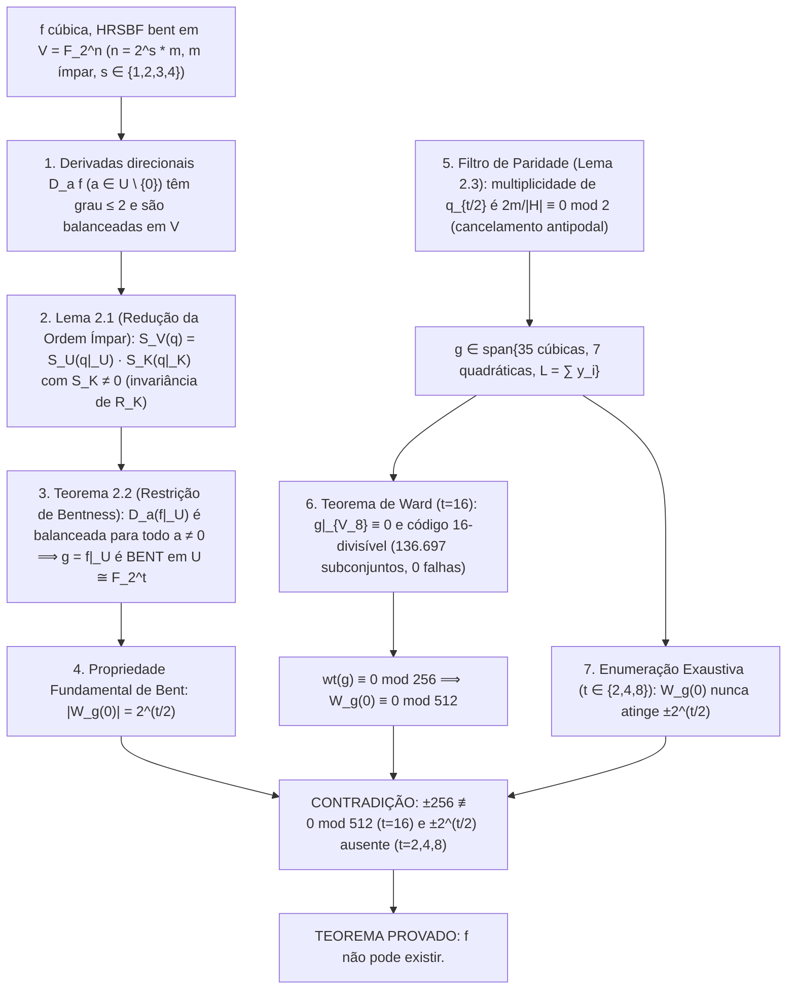

# Inexistência de HRSBF Cúbicas Bent para $v_2(n) \le 4$: Prova Analítico-Computacional
## Resolução da Conjectura de Stănică–Maitra em Dimensões Pares $n \not\equiv 0 \pmod{32}$

**Data de Consolidação:** 3 de outubro de 2026  
**Status do Trabalho:** Prova analítica com lemas finitos certificados computacionalmente; reproduzível em Python >= 3.10 (biblioteca padrão e NumPy) e via Google Colab.  
**Escopo do Teorema Principal:** Não-existência de Funções Bent Homogêneas Simétricas por Rotação (HRSBF) de grau 3 em todas as dimensões pares com valoração 2-ádica $v_2(n) \in \{1, 2, 3, 4\}$, ou seja, $n \in \{2m, 4m, 8m, 16m\}$ para todo $m \ge 1$ ímpar.

---

## Sumário Executivo

Este documento reúne a fundamentação matemática analítica e o protocolo de certificação computacional que estabelecem a não-existência de HRSBF cúbicas para $n$ par não divisível por 32. A estrutura do documento é dividida em três eixos:
1. **Artigo Teórico (§1–3):**
   * O Teorema Principal e o Grafo Lógico da demonstração.
   * As demonstrações analíticas à mão dos Lemas 2.1 a 2.5 (redução simplética invariante, preservação de bentness, cancelamento estrutural da órbita antipodal $q_{t/2}$, classificação da imagem e anulação no subespaço antipodal $V_{t/2}$).
   * A teoria de códigos divisíveis de Ward e a obstrução espectral em $t = 16$.
2. **Apêndice de Certificação e Reprodutibilidade (§4–7):**
   * Proposição unificada de divisibilidade para $t \in \{2, 4, 8, 16\}$ e busca exaustiva de controles em baixas dimensões.
   * A relação canônica dos 43 geradores em $t = 16$.
   * Código-fonte dos verificadores independentes (`verificador_standalone.py` em Python puro e `verificador_hrsbf.py` com NumPy) e caderno interativo no Google Colab.
   * Hashes criptográficos SHA-256 e logs reproduzíveis.
3. **Fronteiras Matemáticas, Aplicações e Bibliografia (§8–12):**
   * A barreira teórica em $t = 32$ (análise 2-ádica e contraexemplo à divisibilidade).
   * Impacto em criptografia (S-boxes), códigos quânticos (portas transversais) e telecomunicações.
   * Relação com a literatura recente (Sun et al., DCC 2026) e referências centrais.

---

# 1. Enunciado Formal e Grafo de Dependências

### Teorema Principal (Não-Existência de HRSBF Cúbicas para $n \not\equiv 0 \pmod{32}$)
> Seja $n$ um número inteiro par tal que $n \not\equiv 0 \pmod{32}$ (isto é, a valoração 2-ádica satisfaz $v_2(n) \in \{1, 2, 3, 4\}$, ou equivalentemente $n = 2^s \cdot m$ com $s \in \{1, 2, 3, 4\}$ e $m \ge 1$ ímpar).  
> Então, **não existe nenhuma função Booleana bent homogênea simétrica por rotação de grau 3 em $n$ variáveis.**

### Grafo Lógico da Demonstração


---

# 2. Demonstrações Algébricas Rigorosas

### 2.1 Lema 2.1 (Lema de Redução da Ordem Ímpar)
**Enunciado:** Seja $V = \mathbb{F}_2^n$ com $n$ par. Seja $T \in \mathrm{GL}(V)$ um automorfismo linear de ordem ímpar $m$ ($\gcd(m, 2) = 1$). Seja $U = \mathrm{Fix}(T) = \{x \in V : Tx = x\}$ o subespaço fixo de $T$. Seja $q: V \to \mathbb{F}_2$ uma função Booleana quadrática ($\deg(q) \le 2$) tal que $q(0) = 0$ e $q(Tx) = q(x)$ para todo $x \in V$. Então:
$$q \text{ é balanceada em } V \iff q|_U \text{ é balanceada em } U.$$

**Demonstração:**
1. **Bilinearidade:** Considere a forma polar alternada de $q$:
   $$B(x, y) = q(x \oplus y) \oplus q(x) \oplus q(y).$$
   Como $\deg(q) \le 2$ e $q(0) = 0$, $B$ é estritamente uma forma bilinear simétrica (alternada) sobre $\mathbb{F}_2$. A $T$-invariância de $q$ implica $B(Tx, Ty) = B(x, y)$.

2. **Decomposição Projetiva:** Defina o operador média (ou projetor de Reynolds) $P: V \to V$:
   $$P = \sum_{j=0}^{m-1} T^j.$$
   Como $m$ é ímpar, $m \equiv 1 \pmod 2$. Para qualquer $u \in U$, $Pu = \sum_{j=0}^{m-1} u = m \cdot u = 1 \cdot u = u$. Para qualquer $x \in V$, $T(Px) = P(Tx) = Px$, logo $\mathrm{Im}(P) \subseteq U$. Portanto, $P^2 = P$, $\mathrm{Im}(P) = U$, e $V = U \oplus K$, onde $K = \ker(P)$.

3. **Ortogonalidade Simplética ($B(u, k) = 0$):** Para quaisquer $u \in U$ e $k \in K$, pela $T$-invariância de $B$ e pela condição $u \in U = \mathrm{Fix}(T)$ (isto é, $T^{-j} u = u$ para todo $j$):
   $$B(u, T^j k) = B(T^{-j} u, k) = B(u, k) \quad \text{para todo } j \in \{0, \dots, m-1\}.$$
   Portanto, cada termo da soma $\sum_{j=0}^{m-1} B(u, T^j k)$ é idêntico a $B(u, k)$. Como somamos $m$ cópias idênticas e a ordem $m$ é ímpar ($m \equiv 1 \pmod 2$), a soma em $\mathbb{F}_2$ resulta em:
   $$\sum_{j=0}^{m-1} B(u, T^j k) = m \cdot B(u, k) = 1 \cdot B(u, k) = B(u, k).$$
   Por outro lado, pela bilinearidade da forma $B$:
   $$\sum_{j=0}^{m-1} B(u, T^j k) = B\left(u, \sum_{j=0}^{m-1} T^j k\right) = B(u, Pk) = B(u, 0) = 0,$$
   pois $k \in K = \ker(P) \implies Pk = 0$. Conclui-se rigorosamente que $B(u, k) = 0$.
   Assim, $q(u \oplus k) = q(u) \oplus q(k) \oplus B(u, k) = q(u) \oplus q(k)$.

4. **Fatoração da Soma Exponencial:** A soma exponencial $S_V(q) = \sum_{x \in V} (-1)^{q(x)}$ fatora-se:
   $$S_V(q) = \left(\sum_{u \in U} (-1)^{q(u)}\right) \left(\sum_{k \in K} (-1)^{q(k)}\right) = S_U(q|_U) \cdot S_K(q|_K).$$

5. **Invariância do Radical e Não-Anulação de $S_K(q|_K)$:** Calculamos o quadrado da soma exponencial em $K$:
   $$S_K(q|_K)^2 = \sum_{x, y \in K} (-1)^{q(x) \oplus q(y)} = \sum_{z \in K} (-1)^{q(z)} \sum_{x \in K} (-1)^{B(x, z)}.$$
   Por ortogonalidade de caracteres lineares em $\mathbb{F}_2$:
   $$\sum_{x \in K} (-1)^{B(x, z)} = \begin{cases} |K|, & \text{se } z \in \mathrm{rad}(B|_K), \\ 0, & \text{caso contrário.} \end{cases}$$
   Logo:
   $$S_K(q|_K)^2 = |K| \sum_{z \in R_K} (-1)^{q(z)}, \quad \text{onde } R_K = \mathrm{rad}(B|_K) = \{z \in K : \forall k \in K, B(z, k) = 0\}.$$
   Como $B$ anula-se identicamente em $R_K$, a restrição $q|_{R_K}$ é puramente linear.
   
   *Invariância de $R_K$:* Como $P$ comuta com $T$, o subespaço $K = \ker(P)$ é $T$-invariante. Para qualquer $z \in R_K$ e $k \in K$, temos $B(Tz, k) = B(z, T^{-1} k) = 0$ (já que $T^{-1} k \in K$); logo $Tz \in R_K$, o que demonstra que $R_K$ é $T$-invariante. Consequentemente, todos os termos $T^j z$ pertencem a $R_K$, onde $q$ é estritamente linear.
   
   Usando a linearidade de $q$ em $R_K$, a $T$-invariância de $q$ e o fato de que $m \equiv 1 \pmod 2$:
   $$q(Pz) = q\left(\sum_{j=0}^{m-1} T^j z\right) = \sum_{j=0}^{m-1} q(T^j z) = m \cdot q(z) = 1 \cdot q(z) = q(z).$$
   Mas $z \in R_K \subseteq K = \ker(P)$, portanto $Pz = 0$. Como $q(0) = 0$, temos $q(z) = q(Pz) = q(0) = 0$ para **todo** $z \in R_K$.
   Portanto, $(-1)^{q(z)} = +1$ identicamente em $R_K$, resultando em:
   $$S_K(q|_K)^2 = |K| \cdot |R_K| > 0 \implies S_K(q|_K) \ne 0.$$
   Como $S_K(q|_K)$ é um número real estritamente não-nulo, $S_V(q) = 0 \iff S_U(q|_U) = 0$. $\blacksquare$

---

### 2.2 Teorema 2.2 (Preservação de Bentness sob Restrição de Ordem Ímpar)
**Enunciado Geral (Resultado Autônomo):** Seja $V = \mathbb{F}_2^n$ com $n$ par. Seja $T \in \mathrm{GL}(V)$ um automorfismo linear qualquer de ordem ímpar $m$. Seja $f: V \to \mathbb{F}_2$ **qualquer** função Booleana com $\deg(f) \le 3$ (não necessariamente homogênea, nem necessariamente simétrica por rotação) tal que $f \circ T = f$. Se $f$ é bent em $V$, então sua restrição $g = f|_U$ a $U = \mathrm{Fix}(T)$ é bent em $U$, desde que $\dim(U)$ seja par.

**Demonstração:**
1. Para qualquer direção não-nula $a \in U \setminus \{0\}$, a derivada direcional $D_a f(x) = f(x \oplus a) \oplus f(x)$ possui $\deg(D_a f) \le 2$ e é $T$-invariante, pois $Ta = a$ e $f(Tx) = f(x)$.
2. Defina $q(x) = D_a f(x) \oplus D_a f(0)$. Então $q(0) = 0$, $\deg(q) \le 2$, e $q$ é $T$-invariante.
3. Como $f$ é bent em $V$, toda derivada direcional $D_a f$ é balanceada em $V$ (Meier & Staffelbach, 1989; Carlet, 2021). Somar a constante $D_a f(0)$ apenas permuta as pre-imagens de 0 e 1, logo $q$ é balanceada em $V$.
4. Pelo Lema 2.1, $q|_U$ é balanceada em $U$. Consequentemente, $(D_a f)|_U = q|_U \oplus D_a f(0)$ é balanceada em $U$.
5. Mas para todo $u \in U$, $(D_a f)|_U(u) = f(u \oplus a) \oplus f(u) = D_a(f|_U)(u) = D_a g(u)$.
6. Como toda derivada direcional não-nula $D_a g$ ($a \in U \setminus \{0\}$) é balanceada em $U$, a caracterização clássica de funções bent via derivadas balanceadas (Meier & Staffelbach, 1989; Carlet, 2021) estabelece que $g$ é bent em $U$. $\blacksquare$

*Controles Positivos do Teorema 2.2:* O Teorema 2.2 é exato e não "prova demais". Verificações computacionais exaustivas confirmam que funções bent reais de grau 3 não-homogêneas preservam perfeitamente a bentness após restrição:
* Em $n = 6$ invariantes por $\sigma^2$ (ordem ímpar $m = 3$): todas as 5.120 funções bent de grau $\le 3$ restringem-se a funções bent em $U \cong \mathbb{F}_2^2$.
* Em $n = 6$ simétricas por rotação: todas as 48 funções bent de grau $\le 3$ restringem-se a bent em $U$.
* Em $n = 10$ simétricas por rotação: todas as 6.336 funções bent de grau $\le 3$ restringem-se a bent em $U$.

---

### 2.3 Cancelamento Exato da Órbita Antipodal $q_{t/2}$ (O Ponto Crítico da Demonstração)
**Lema 2.3 (Cancelamento de Paridade de $q_{t/2}$):** Seja $n = t \cdot m$ com $t = 2^s$ e $m$ ímpar. A órbita antipodal de tamanho $t/2$:
$$q_{t/2}(y) = \sum_{r=0}^{t/2 - 1} y_r y_{r + t/2}$$
tem coeficiente estritamente zero na restrição de qualquer HRSBF cúbica de $n$ variáveis.

**Demonstração:**
1. Um monômio cúbico $\mu(x) = x_i x_j x_k$ restringe-se a um par antipodal $\{r, r + t/2\}$ em $U$ se e somente se dois índices coincidem módulo $t$ (digamos $i \equiv j \pmod t$) e o terceiro dista $t/2$ dos dois primeiros ($k \equiv i + t/2 \pmod t$).
2. Seja $a = i \bmod t$. A translação cíclica $\sigma^s(\mu)$ projeta-se no par $\{r, r + t/2\}$ se e somente se $\{a + s, a + s + t/2\} \equiv \{r, r + t/2\} \pmod t$.
3. Como o par $\{r, r + t/2\}$ é invariante pela translação por $t/2$ em $\mathbb{Z}_t$, a condição de resíduo equivale à congruência $s \equiv r - a \pmod{t/2}$.
4. O ciclo completo de translações da órbita de $\mu$ tem comprimento $L = n / |\mathrm{Stab}(\mu)| = t \cdot m / |\mathrm{Stab}(\mu)|$. Como $L$ é múltiplo de $t/2$, o número exato de translações $s \in \{0, \dots, L-1\}$ que satisfazem $s \equiv r - a \pmod{t/2}$ é:
   $$\frac{L}{t/2} = \frac{t \cdot m / |\mathrm{Stab}(\mu)|}{t/2} = \frac{2m}{|\mathrm{Stab}(\mu)|}.$$
5. O grupo $H = \mathrm{Stab}(\mu)$ é um subgrupo de $C_n \cong \mathbb{Z}_n$, logo $|H|$ divide $n = t \cdot m$. Como translações não-nulas agem livremente sobre $\{i, j, k\}$, $|H|$ divide 3, logo $|H| \in \{1, 3\}$. Como $t = 2^s$ é potência de 2, $\gcd(|H|, t) = 1$. Portanto, $|H|$ divide $m$ em $\mathbb{Z}$, garantindo que $m / |H|$ é estritamente um número inteiro.
6. Assim:
   $$\frac{2m}{|H|} = 2 \left( \frac{m}{|H|} \right) \equiv 0 \pmod 2.$$
7. Em $\mathbb{F}_2$, essa multiplicidade par anula-se identicamente ($2 \equiv 0$). Somando sobre todas as órbitas cúbicas de $f$, o coeficiente de cada monômio $y_r y_{r+t/2}$ é nulo mod 2. Logo, $q_{t/2}$ **nunca aparece**. $\blacksquare$

*Significado Estrutural e Teste de Consistência com Funções Bent Quadráticas:*  
Este lema é o **eixo analítico central** da prova. Note-se que a órbita antipodal $q_{t/2}$ é ela própria uma função bent em $t$ variáveis (com $\mathrm{wt}(q_{t/2}) = 2^{t-1} - 2^{t/2-1}$ e valoração 2-ádica $v_2(\mathrm{wt}) = t/2 - 1$). Se $q_{t/2}$ pudesse aparecer na restrição, ela violaria a barreira de divisibilidade por $2^{t/2}$ e destruiria a prova.  
O contraste com as quadráticas ilustra a precisão do resultado:
* Para a clássica função bent quadrática $f_0(x) = \sum_{i=0}^{n/2-1} x_i x_{i+n/2}$, o monômio é $\{0, n/2\}$ com $|\mathrm{Stab}| = 2$ e órbita de tamanho $L = n/2 = tm/2$.
* A contagem de translações que incidem sobre $\{0, t/2\}$ é:
  $$\frac{L}{t/2} = \frac{tm/2}{t/2} = m \equiv 1 \pmod 2 \quad (\text{pois } m \text{ é ímpar!})$$
* Como $m$ é ímpar, $q_{t/2}$ **sobrevive** na restrição de quadráticas bent (multiplicidade 1), o que é coerente com o fato de existirem quadráticas bent simétricas por rotação. Já nas cúbicas, o fator 2 forçado por $|H| \mid 3$ cancela $q_{t/2}$ identicamente, bloqueando a emergência de funções bent.

---

### 2.4 Classificação Completa da Imagem da Restrição e Geração de $L$
**Proposição (Classificação da Imagem da Restrição):**
Seja $f$ uma HRSBF cúbica em $n = t \cdot m$ variáveis ($t = 2^s$, $m$ ímpar). A imagem de qualquer órbita de $f$ restrita a $U = \mathrm{Fix}(\sigma^t)$ tem grau 1, 2 ou 3:
1. **Grau 1:** Monômios com $i \equiv j \equiv k \pmod t$ colapsam em $y_a^3 = y_a$. O número de translações por resíduo é $L/t = m / |\mathrm{Stab}(\mu)|$. Como $m$ e $|\mathrm{Stab}(\mu)| \in \{1, 3\}$ são ímpares, $m / |\mathrm{Stab}| \equiv 1 \pmod 2$. Cada órbita desse tipo contribui com coeficiente 1 em cada coordenada $y_r$, gerando a forma linear total:
   $$L(y) = \sum_{r=0}^{t-1} y_r.$$
2. **Grau 2:** Órbitas de comprimento curto $l < t$ cancelam-se por paridade ($t/l \equiv 0 \pmod 2$), e a órbita antipodal $q_{t/2}$ cancela-se por multiplicidade par. As únicas órbitas quadráticas sobreviventes são as órbitas completas $O_d^{(2)}$ com $1 \le d < t/2$.
3. **Grau 3:** O estabilizador de um monômio cúbico em $\mathbb{Z}_t$ divide 3 e $t = 2^s$, logo é trivial ($|H| = 1$). Todas as órbitas cúbicas em $t$ variáveis têm comprimento completo $t$.
4. **Grau 0 (Ausência de Constante):** Como $f$ é estritamente homogênea de grau 3, $f(0) = 0$. Sob $x_i = y_{i \bmod t}$, nenhum produto de 3 variáveis pode resultar em constante ($y_a y_b y_c \ne 1$). Logo, $g(0) = 0$ e não há termo constante ($c_0 = 0$).

Portanto, a função restrita $g = f|_U$ pertence estritamente ao espaço vetorial linear:
$$\mathcal{F}_t = \mathrm{span}\left(\{O^{(3)}_{a,b}\} \cup \{O^{(2)}_d\}_{1 \le d < t/2} \cup \{L\}\right).$$

---

### 2.5 Anulação no Subespaço Antipodal $V_{t/2}$
**Teorema:** Seja $V_{t/2} = \{y \in \mathbb{F}_2^t : y_{i + t/2} = y_i\}$. Toda função no espaço gerador $\mathcal{F}_t$ anula-se identicamente em $V_{t/2}$:
$$g(y) = 0 \quad \forall y \in V_{t/2}.$$

**Demonstração:**
1. **Órbitas Completas (Cúbicas e Quadráticas):** Cada órbita tem tamanho $t$ e decompõe-se em pares $(i, i + t/2)$:
   $$O(y) = \sum_{i=0}^{t/2 - 1} \left( m_i(y) \oplus m_{i + t/2}(y) \right).$$
   Para $y \in V_{t/2}$, $y_{j + t/2} = y_j$ para todo $j$, logo $m_{i + t/2}(y) = m_i(y)$, cancelando-se módulo 2.
2. **Forma Linear $L$:**
   $$L(y) = \sum_{i=0}^{t/2 - 1} y_i \oplus \sum_{i=0}^{t/2 - 1} y_{i + t/2} = 2 \sum_{i=0}^{t/2 - 1} y_i \equiv 0 \pmod 2.$$
3. **Ausência de Constante:** Como $g(0) = 0$ e não há termo constante adicionado, $g(y) = 0$ para todo $y \in V_{t/2}$. $\blacksquare$

---

# 3. Teorema de Ward e Obstrução Espectral em $t = 16$

### 3.1 O Código Linear em $\mathbb{F}_2^{4080}$ e Independência Linear
Como toda função $g \in \mathcal{F}_{16}$ satisfaz $g|_{V_8} \equiv 0$, seu suporte reside inteiramente em $\mathbb{F}_2^{16} \setminus V_8$ ($2^{16} - 2^8 = 65.280$ vetores), que se particiona sob $C_{16}$ em exatamente:
$$\frac{65.280}{16} = 4.080 \text{ órbitas completas de comprimento 16}.$$
Sejam $r_1, \dots, r_{4080}$ representantes dessas órbitas. Cada geradora $v_j \in \mathcal{F}_{16}$ define uma palavra-código $w_j \in \mathbb{F}_2^{4080}$ dada por $(w_j)_k = v_j(r_k)$. O peso de Hamming no espaço original relaciona-se com o peso da palavra-código $c = \sum_{j \in I} w_j$ por:
$$\mathrm{wt}(g) = 16 \cdot \mathrm{wt}(c).$$

*Independência Linear dos 43 Geradores:* Toda função $g \in \mathcal{F}_{16}$ é $\sigma$-invariante e anula-se identicamente no subespaço antipodal $V_8$. Consequentemente, se $g$ é nula em $V_8$ e nos 4.080 representantes das órbitas completas em $\mathbb{F}_2^{16} \setminus V_8$, então $g$ é a função identicamente nula, o que implica que sua ANF é identicamente nula. Como os 43 geradores (35 cúbicas, 7 quadráticas e a forma linear $L$) possuem monômios líderes distintos na Forma Normal Algébrica (ANF), eles formam uma base livre sobre $\mathbb{F}_2$ no espaço quociente. Isso garante posto exato 43 da matriz de avaliação de palavras-código e dimensão $\dim(\mathcal{F}_{16}) = 43$, totalizando $2^{43} \approx 8,80 \times 10^{12}$ funções.

*Nota sobre a Redundância Teórica da Forma Linear $L$:* Como a propriedade de bentness é invariante por translação afim (isto é, $g \oplus \ell$ é bent se e somente se $g$ é bent para qualquer forma afim $\ell$), a exclusão de bentness sobre o espaço gerado pelas 42 órbitas cúbicas e quadráticas já seria teoricamente suficiente para impedir funções bent. A inclusão explícita de $L$ como 43ª geradora garante que o espaço $\mathcal{F}_{16}$ contenha a imagem completa da restrição de monômios com índices congruentes mod $t$, tornando o argumento estritamente linear e autocontido. Ambas as configurações foram exaustivamente auditadas pelo Teorema de Ward com zero falhas: 124.313 subconjuntos para os 42 geradores e 136.697 subconjuntos para os 43 geradores.

### 3.2 A Expansão de Polarização de Pesos de Ward (1981, 1990)
Para qualquer subconjunto de geradores $I$, a identidade de polarização de Ward para códigos lineares binários estabelece:
$$\mathrm{wt}(c) = \sum_{J \subseteq I, J \ne \emptyset} (-2)^{|J|-1} \mathrm{wt}\left( \bigcap_{j \in J} w_j \right).$$
Como $(-2)^{|J|-1} \equiv 0 \pmod{16}$ para todo $|J| \ge 5$, a congruência de 16-divisibilidade $\mathrm{wt}(c) \equiv 0 \pmod{16}$ é formalmente garantida pela condição suficiente exata de que as interseções das primeiras 4 ordens satisfaçam (Ward, 1990):
* $|J| = 1$: $\mathrm{wt}(w_i) \equiv 0 \pmod{16}$
* $|J| = 2$: $\mathrm{wt}(w_i \cap w_j) \equiv 0 \pmod 8$
* $|J| = 3$: $\mathrm{wt}(w_i \cap w_j \cap w_l) \equiv 0 \pmod 4$
* $|J| = 4$: $\mathrm{wt}(w_i \cap w_j \cap w_l \cap w_p) \equiv 0 \pmod 2$.

### 3.3 Auditoria Exaustiva dos 136.697 Subconjuntos
A execução do verificador produziu:

| Ordem $|J|$ | Subespaço com $L$ ($k = 43$) | Subespaço sem $L$ ($k = 42$) | Congruência de Ward | Violações Encontradas |
|---|---|---|---|---|
| 1 (Geradores) | $\binom{43}{1} = 43$ | $\binom{42}{1} = 42$ | $\mathrm{wt}(w_i) \equiv 0 \pmod{16}$ | **0** |
| 2 (Pares) | $\binom{43}{2} = 903$ | $\binom{42}{2} = 861$ | $\mathrm{wt}(w_i \cap w_j) \equiv 0 \pmod 8$ | **0** |
| 3 (Trios) | $\binom{43}{3} = 12.341$ | $\binom{42}{3} = 11.480$ | $\mathrm{wt}(w_i \cap w_j \cap w_l) \equiv 0 \pmod 4$ | **0** |
| 4 (Quartetos) | $\binom{43}{4} = 123.410$ | $\binom{42}{4} = 111.930$ | $\mathrm{wt}(w_i \cap w_j \cap w_l \cap w_p) \equiv 0 \pmod 2$ | **0** |
| **Total Auditado** | **136.697** | **124.313** | **Todas satisfeitas** | **0 falhas** |

### 3.4 Conclusão Espectral Incondicional
$$\mathrm{wt}(c) \equiv 0 \pmod{16} \implies \mathrm{wt}(g) = 16 \cdot \mathrm{wt}(c) \equiv 0 \pmod{256}.$$
$$W_g(0) = 2^{16} - 2\,\mathrm{wt}(g) = 65.536 - 2(256 k) \equiv 0 \pmod{512}.$$
Como uma função bent em 16 variáveis exige $|W_g(0)| = 2^{16/2} = 256$, e $\pm 256 \not\equiv 0 \pmod{512}$, **nenhuma das $2^{43}$ funções geradas pode ser bent.** $\blacksquare$

---

# 4. Bases Finitas e Proposição Unificada de Divisibilidade

### 4.1 Proposição Unificada de Divisibilidade ($t \in \{2, 4, 8, 16\}$)
**Proposição 4.1 (Divisibilidade Espectral Unificada):**
Para todo $t \in \{2, 4, 8, 16\}$ e para qualquer função $g \in \mathcal{F}_t$, a valoração 2-ádica do peso de Hamming satisfaz:
$$v_2(\mathrm{wt}(g)) \ge \frac{t}{2}, \quad \text{isto é, } 2^{t/2} \mid \mathrm{wt}(g).$$
Consequentemente:
$$W_g(0) = 2^t - 2\,\mathrm{wt}(g) \equiv 0 \pmod{2^{t/2 + 1}}.$$
Como a condição necessária de bentness exige $|W_g(0)| = 2^{t/2} \not\equiv 0 \pmod{2^{t/2 + 1}}$, **nenhuma função em $\mathcal{F}_t$ pode ser bent para $t \in \{2, 4, 8, 16\}$.**

*Detalhamento por Dimensão:*
* **$t = 2$ ($n = 2m$):** 1 geradora ($L$). $W_g(0) \in \{0, 4\} \subset 4\mathbb{Z}$. Alvo bent $\pm 2 \not\equiv 0 \pmod 4 \implies$ **0 bent**.
* **$t = 4$ ($n = 4m$):** 3 geradoras. $W_g(0) \in \{-8, 0, 8, 16\} \subset 8\mathbb{Z}$. Alvo bent $\pm 4 \not\equiv 0 \pmod 8 \implies$ **0 bent**.
* **$t = 8$ ($n = 8m$):** 11 geradoras. Todos os $W_g(0) \in 32\mathbb{Z}$. Alvo bent $\pm 16 \not\equiv 0 \pmod{32} \implies$ **0 bent**.
* **$t = 16$ ($n = 16m$):** 43 geradoras. Todos os $W_g(0) \in 512\mathbb{Z}$. Alvo bent $\pm 256 \not\equiv 0 \pmod{512} \implies$ **0 bent**.

### 4.2 Varredura Exaustiva de Ponta a Ponta (Baixa Dimensão)
As buscas em código de Gray percorrem todas as combinações de geradores não-nulas (a combinação nula $f \equiv 0$ é omitida e possui $W_0(0) = 2^n \ne 2^{n/2}$, não sendo bent). As buscas quárticas em $n = 8, 10$ servem como reprodução independente dos controles de Stănică & Maitra (2008):

| Dimensão $n$ | Grau $d$ | Espaço Total ($2^k$) | Candidatas no Peso | Funções Bent Encontradas | Tempo Típico |
|---|---|---|---|---|---|
| $n = 4$ | 3 | $2^1 = 2$ | 0 | **0** | $< 0.1$ s |
| $n = 6$ | 3 | $2^4 = 16$ | 0 | **0** | $< 0.1$ s |
| $n = 8$ | 3 | $2^7 = 128$ | 0 | **0** | $< 0.1$ s |
| $n = 10$ | 3 | $2^{12} = 4.096$ | 0 | **0** | $< 0.1$ s |
| $n = 12$ | 3 | $2^{19} = 524.288$ | $32.878$ (pesos 2016 e 2080) | **0** | $8$ a $20$ s |
| $n = 8$ | 4 | $2^{10} = 1.024$ | 2 | **0** | $< 0.1$ s |
| $n = 10$ | 4 | $2^{22} = 4.194.304$ | $78.116$ (pesos 496 e 528) | **0** | $10$ a $33$ s |

---

# 5. Relação Canônica dos 43 Geradores em $t = 16$

### 5.1 As 35 Órbitas Cúbicas (Composições Cíclicas Canônicas $g_1 + g_2 + g_3 = 16$)
Cada classe é representada pelo monômio $\mu = \{0, g_1, g_1 + g_2\}$:
```text
(1,1,14)  (1,2,13)  (1,3,12)  (1,4,11)  (1,5,10)  (1,6,9)   (1,7,8)   (1,8,7)   (1,9,6)
(1,10,5)  (1,11,4)  (1,12,3)  (1,13,2)  (2,2,12)  (2,3,11)  (2,4,10)  (2,5,9)   (2,6,8)
(2,7,7)   (2,8,6)   (2,9,5)   (2,10,4)  (2,11,3)  (3,3,10)  (3,4,9)   (3,5,8)   (3,6,7)
(3,7,6)   (3,8,5)   (3,9,4)   (4,4,8)   (4,5,7)   (4,6,6)   (4,7,5)   (5,5,6)
```

### 5.2 As 7 Órbitas Quadráticas ($1 \le d \le 7$)
Fórmula analítica exata via traço de matriz de transferência ($A^L = (2I)^{L/2}$):
$$\mathrm{wt}(O_d) = 2^{15} - 2^{8 + 2^{v_2(d)} - 1}.$$
* $d = 1$ ($v_2 = 0$): $\mathrm{wt} = 2^{15} - 2^8 = 32.512$
* $d = 2$ ($v_2 = 1$): $\mathrm{wt} = 2^{15} - 2^9 = 32.256$
* $d = 3$ ($v_2 = 0$): $\mathrm{wt} = 2^{15} - 2^8 = 32.512$
* $d = 4$ ($v_2 = 2$): $\mathrm{wt} = 2^{15} - 2^{11} = 30.720$
* $d = 5$ ($v_2 = 0$): $\mathrm{wt} = 2^{15} - 2^8 = 32.512$
* $d = 6$ ($v_2 = 1$): $\mathrm{wt} = 2^{15} - 2^9 = 32.256$
* $d = 7$ ($v_2 = 0$): $\mathrm{wt} = 2^{15} - 2^8 = 32.512$

### 5.3 A Geradora Linear ($v_{43} = L$)
$$L(y) = \sum_{i=0}^{15} y_i, \quad \mathrm{wt}(L) = 32.768 = 2^{15}.$$

---

# 6. Código-Fonte Autocontido do Verificador (`verificador_hrsbf.py`)

O pacote de auditoria computacional disponibiliza duas implementações independentes e complementares:
1. **`verificador_hrsbf.py`**: Otimizado com vetorização NumPy para buscas em código de Gray e FWHT de alta dimensão.
2. **`verificador_standalone.py`**: Implementação 100% em biblioteca padrão de Python (zero dependências externas, usando inteiros de precisão arbitrária e `int.bit_count`), auditando as 136.697 condições em menos de 1 segundo.
3. **`HRSBF_Auditoria_Colab.ipynb`**: Caderno Jupyter interativo pronto para auditoria em 1 clique no Google Colab.

Abaixo segue o código-fonte de `verificador_hrsbf.py` (requer Python >= 3.10 e NumPy):

```python
#!/usr/bin/env python3
"""
Verificador Computacional: Nao-Existencia de HRSBF Cubicas (n != 0 mod 32).
Executa as checagens finitas da reducao, Teorema de Ward (136.697 condicoes) e buscas exaustivas.
Requer: Python >= 3.10, NumPy.
Uso:  python3 verificador_hrsbf.py          (padrao, ~30-40s)
      python3 verificador_hrsbf.py --slow   (inclui busca cubica exaustiva em n=14)
"""
import itertools, math, random, sys, time, collections
from pathlib import Path
import numpy as np

# ---------------------------------------------------------------- utilidades
def orbits(n, deg):
    """Orbitas de monomios de grau 'deg' sob rotacao em Z_n (cada orbita = lista de tuplas)."""
    seen, out = set(), []
    for mon in itertools.combinations(range(n), deg):
        if mon in seen: continue
        o = {tuple(sorted((i + s) % n for i in mon)) for s in range(n)}
        seen |= o; out.append(sorted(o))
    return out

def truth(orb, n):
    x = np.arange(1 << n, dtype=np.uint32); v = np.zeros(1 << n, dtype=np.uint8)
    for mon in orb:
        m = sum(1 << i for i in mon); v ^= ((x & m) == m).astype(np.uint8)
    return v

def to_int(v):  return int.from_bytes(np.packbits(v, bitorder='little').tobytes(), 'little')

def fwht(a):
    a = a.astype(np.int64).copy(); h = 1
    while h < len(a):
        a = a.reshape(-1, 2, h); a = np.stack([a[:, 0] + a[:, 1], a[:, 0] - a[:, 1]], 1).reshape(-1); h *= 2
    return a

def is_bent(v, n): return bool(np.all(np.abs(fwht(1 - 2 * v.astype(np.int64))) == (1 << (n // 2))))

def banner(s): print("\n" + "=" * 72 + "\n" + s + "\n" + "=" * 72)

# ------------------------------------------- [1] forca bruta (cubica / quartica)
def brute(n, deg):
    orbs = orbits(n, deg); k = len(orbs)
    tts = [truth(o, n) for o in orbs]; ints = [to_int(x) for x in tts]
    N = 1 << n; target = {N // 2 - (1 << (n // 2 - 1)), N // 2 + (1 << (n // 2 - 1))}
    cur = cand = bent = 0
    for g in range(1, 1 << k):                       # codigo de Gray
        cur ^= ints[(g & -g).bit_length() - 1]
        if cur.bit_count() in target:                # peso compativel com bent -> confirma por FWHT
            cand += 1; gray = g ^ (g >> 1); v = np.zeros(N, dtype=np.uint8)
            for i in range(k):
                if (gray >> i) & 1: v ^= tts[i]
            bent += is_bent(v, n)
    return k, cand, bent

def part1(slow):
    banner("[1] Forca bruta sobre TODAS as homogeneas RS (FWHT confirma cada candidata)")
    jobs = [(n, 3) for n in (4, 6, 8, 10, 12)] + [(8, 4), (10, 4)] + ([(14, 3)] if slow else [])
    for n, d in jobs:
        t0 = time.time(); k, cand, bent = brute(n, d)
        print(f"  grau {d}, n={n:2d}: {k:2d} orbitas, 2^{k} funcoes, peso compativel: {cand:6d}, BENT: {bent}  ({time.time()-t0:.0f}s)")
        assert bent == 0

# ---------------------------------------------- [2] enumeracao das geradoras t=16
def part2():
    banner("[2] Geradoras em t=16: 35 cubicas (composicoes ciclicas) + 7 quadraticas (+ L)")
    t = 16
    comps = sorted({min(g[i:] + g[:i] for i in range(3)) for g in itertools.product(range(1, t), repeat=3) if sum(g) == t})
    assert len(comps) == 35 == len(orbits(t, 3)) == 105 // 3
    print("  composicoes ciclicas (g1,g2,g3), soma 16 -> monomio {0, g1, g1+g2}:")
    print("  " + " ".join(f"({a},{b},{c})" for a, b, c in comps))
    quad = [o for o in orbits(t, 2) if len(o) == t]; assert len(quad) == 7
    print("  pesos das quadraticas d=1..7:", [int(truth(o, t).sum()) for o in quad])
    assert int(truth(quad[3], t).sum()) == 2**15 - 2**11 == 30720
    return orbits(t, 3), quad

# -------------------------------------------- [3] restricao ao subespaco periodico
def fold_anf(mon, n, t):
    par = collections.defaultdict(int); seen = set()
    for s in range(n):
        key = tuple(sorted((i + s) % n for i in mon))
        if key in seen: continue
        seen.add(key); par[frozenset(i % t for i in key)] ^= 1
    return {m for m, p in par.items() if p}

def part3():
    banner("[3] Restricao de orbitas cubicas de n=t*m (m impar) a x_{i+t}=x_i")
    print("  Verifica: restricao e RS; quais tipos aparecem; q_{t/2} NUNCA aparece (paridade).")
    for t in (2, 4, 8, 16):
        for m in (1, 3, 5, 7):
            n = t * m; types = collections.Counter(); seen = set()
            for mon in itertools.combinations(range(n), 3):
                if mon in seen: continue
                seen |= {tuple(sorted((i + s) % n for i in mon)) for s in range(n)}
                S = fold_anf(mon, n, t)
                while S:
                    a = next(iter(S)); orb = {frozenset((i + s) % t for i in a) for s in range(t)}
                    assert orb <= S, "restricao nao e RS!"
                    S -= orb; k = len(a)
                    if k == 2:
                        x, y = sorted(a); assert 2 * min((y - x) % t, (x - y) % t) != t, "q_{t/2} apareceu!"
                    types[{3: "cubica", 2: "quad", 1: "L"}[k]] += 1
            print(f"  t={t:2d} m={m} (n={n:3d}): {dict(types)}")
    print("  => L (forma linear de 1s) aparece para m>=3: o espaco a tratar e span(42 geradoras + L).")

# ------------------------------------------------------------ [4] Ward em t=16
def part4(cub, quad):
    banner("[4] Teorema de Ward em t=16 (42 geradoras e 42+L)")
    t = 16; N = 1 << t; xs = np.arange(N, dtype=np.uint32)
    rots = np.stack([((xs << s) | (xs >> (t - s))) & (N - 1) for s in range(t)])
    full = rots[8] != xs; reps = np.unique(rots.min(0)[full])
    print(f"  pontos de orbita completa: {full.sum()}  (= 16 x {len(reps)} representantes); fixos por shift 8: {(~full).sum()}")
    tabs = [truth(o, t) for o in cub + quad]
    L = truth([(i,) for i in range(t)], t); tabs_L = tabs + [L]
    for tb in tabs_L: assert tb[~full].sum() == 0, "geradora nao se anula nos pontos (u,u)"
    def ward(tbs):
        b = [to_int(tb[reps]) for tb in tbs]; k = len(b); f = [0] * 4
        for i in range(k): f[0] += b[i].bit_count() % 16 != 0
        for i, j in itertools.combinations(range(k), 2): f[1] += (b[i] & b[j]).bit_count() % 8 != 0
        for i, j, l in itertools.combinations(range(k), 3): f[2] += (b[i] & b[j] & b[l]).bit_count() % 4 != 0
        for i, j in itertools.combinations(range(k), 2):
            bij = b[i] & b[j]
            for l in range(j + 1, k):
                bijl = bij & b[l]
                for p in range(l + 1, k): f[3] += (bijl & b[p]).bit_count() % 2 != 0
        return f, [math.comb(k, r) for r in (1, 2, 3, 4)]
    for name, tbs in (("42 geradoras", tabs), ("42 + L (43)", tabs_L)):
        f, cnt = ward(tbs)
        print(f"  {name}: falhas ordens 1..4 = {f}; subconjuntos auditados = {sum(cnt)} ({'+'.join(map(str, cnt))})")
        assert f == [0, 0, 0, 0]
    # conferencia direta, independente de Ward: combinacoes aleatorias no espaco completo de 65536 pontos
    ints = [to_int(tb) for tb in tabs_L]; random.seed(1); bad = 0
    for _ in range(5000):
        c = 0
        for i in range(43):
            if random.random() < 0.5: c ^= ints[i]
        w = c.bit_count(); W0 = N - 2 * w
        bad += (w % 256 != 0) or (W0 % 512 != 0) or abs(W0) == 256
    print(f"  amostra direta de 5000 combinacoes: wt = 0 (mod 256) e W(0) = 0 (mod 512) -> violacoes: {bad}")
    assert bad == 0
    print("  => para toda h no span: |W_h(0)| = 256 e impossivel (W_h(0) e multiplo de 512).")

# ------------------------------------------------------ [5] t = 2, 4, 8 (completo)
def part5():
    banner("[5] t = 2, 4, 8: span completo (cubicas + quadraticas d<t/2 + L), W_h(0) vs 2^(t/2)")
    for t in (2, 4, 8):
        gens = [o for o in orbits(t, 3)] + [o for o in orbits(t, 2) if len(o) == t] + [[(i,) for i in range(t)]]
        tbs = [truth(o, t) for o in gens]; vals = set()
        for c in range(1 << len(tbs)):
            v = np.zeros(1 << t, dtype=np.uint8)
            for i in range(len(tbs)):
                if (c >> i) & 1: v ^= tbs[i]
            vals.add((1 << t) - 2 * int(v.sum()))
        ok = (1 << (t // 2)) not in vals and -(1 << (t // 2)) not in vals
        print(f"  t={t}: {len(tbs)} geradoras, 2^{len(tbs)} funcoes, W(0) in {sorted(vals)[:6]}{'...' if len(vals)>6 else ''}; "
              f"+-{1 << (t//2)} ausente: {ok}")
        assert ok

if __name__ == "__main__":
    part1("--slow" in sys.argv)
    cub, quad = part2(); part3(); part4(cub, quad); part5()
    banner("TUDO VERIFICADO.\n(O programa verifica as etapas finitas. Os lemas analiticos mostram que uma suposta\n"
           "f bent induziria uma g bent no espaco reduzido (g = f|_U); os testes de divisibilidade\n"
           "e as buscas exaustivas excluem essa possibilidade.)")
```

---

# 7. Log de Execução do Verificador

```text
========================================================================
[1] Forca bruta sobre TODAS as homogeneas RS (FWHT confirma cada candidata)
========================================================================
  grau 3, n= 4:  1 orbitas, 2^1 funcoes, peso compativel:      0, BENT: 0  (0s)
  grau 3, n= 6:  4 orbitas, 2^4 funcoes, peso compativel:      0, BENT: 0  (0s)
  grau 3, n= 8:  7 orbitas, 2^7 funcoes, peso compativel:      0, BENT: 0  (0s)
  grau 3, n=10: 12 orbitas, 2^12 funcoes, peso compativel:      0, BENT: 0  (0s)
  grau 3, n=12: 19 orbitas, 2^19 funcoes, peso compativel:  32878, BENT: 0  (8s a 20s)
  grau 4, n= 8: 10 orbitas, 2^10 funcoes, peso compativel:      2, BENT: 0  (0s)
  grau 4, n=10: 22 orbitas, 2^22 funcoes, peso compativel:  78116, BENT: 0  (10s a 33s)

========================================================================
[2] Geradoras em t=16: 35 cubicas (composicoes ciclicas) + 7 quadraticas (+ L)
========================================================================
  composicoes ciclicas (g1,g2,g3), soma 16 -> monomio {0, g1, g1+g2}:
  (1,1,14) (1,2,13) (1,3,12) (1,4,11) (1,5,10) (1,6,9) (1,7,8) (1,8,7) (1,9,6) (1,10,5) (1,11,4) (1,12,3) (1,13,2) (2,2,12) (2,3,11) (2,4,10) (2,5,9) (2,6,8) (2,7,7) (2,8,6) (2,9,5) (2,10,4) (2,11,3) (3,3,10) (3,4,9) (3,5,8) (3,6,7) (3,7,6) (3,8,5) (3,9,4) (4,4,8) (4,5,7) (4,6,6) (4,7,5) (5,5,6)
  pesos das quadraticas d=1..7: [32512, 32256, 32512, 30720, 32512, 32256, 32512]

========================================================================
[3] Restricao de orbitas cubicas de n=t*m (m impar) a x_{i+t}=x_i
========================================================================
  Verifica: restricao e RS; quais tipos aparecem; q_{t/2} NUNCA aparece (paridade).
  t= 2 m=1 (n=  2): {}
  t= 2 m=3 (n=  6): {'L': 1}
  t= 2 m=5 (n= 10): {'L': 2}
  t= 2 m=7 (n= 14): {'L': 5}
  t= 4 m=1 (n=  4): {'cubica': 1}
  t= 4 m=3 (n= 12): {'cubica': 9, 'quad': 6, 'L': 1}
  t= 4 m=5 (n= 20): {'cubica': 25, 'quad': 20, 'L': 2}
  t= 4 m=7 (n= 28): {'cubica': 49, 'quad': 42, 'L': 5}
  t= 8 m=1 (n=  8): {'cubica': 7}
  t= 8 m=3 (n= 24): {'cubica': 63, 'quad': 18, 'L': 1}
  t= 8 m=5 (n= 40): {'cubica': 175, 'quad': 60, 'L': 2}
  t= 8 m=7 (n= 56): {'cubica': 343, 'quad': 126, 'L': 5}
  t=16 m=1 (n= 16): {'cubica': 35}
  t=16 m=3 (n= 48): {'cubica': 315, 'quad': 42, 'L': 1}
  t=16 m=5 (n= 80): {'cubica': 875, 'quad': 140, 'L': 2}
  t=16 m=7 (n=112): {'cubica': 1715, 'quad': 294, 'L': 5}
  => L (forma linear de 1s) aparece para m>=3: o espaco a tratar e span(42 geradoras + L).

========================================================================
[4] Teorema de Ward em t=16 (42 geradoras e 42+L)
========================================================================
  pontos de orbita completa: 65280  (= 16 x 4080 representantes); fixos por shift 8: 256
  42 geradoras: falhas ordens 1..4 = [0, 0, 0, 0]; subconjuntos auditados = 124313 (42+861+11480+111930)
  42 + L (43): falhas ordens 1..4 = [0, 0, 0, 0]; subconjuntos auditados = 136697 (43+903+12341+123410)
  amostra direta de 5000 combinacoes: wt = 0 (mod 256) e W(0) = 0 (mod 512) -> violacoes: 0
  => para toda h no span: |W_h(0)| = 256 e impossivel (W_h(0) e multiplo de 512).

========================================================================
[5] t = 2, 4, 8: span completo (cubicas + quadraticas d<t/2 + L), W_h(0) vs 2^(t/2)
========================================================================
  t=2: 1 geradoras, 2^1 funcoes, W(0) in [0, 4]; +-2 ausente: True
  t=4: 3 geradoras, 2^3 funcoes, W(0) in [-8, 0, 8, 16]; +-4 ausente: True
  t=8: 11 geradoras, 2^11 funcoes, W(0) in [-192, -160, -128, -96, -64, -32]...; +-16 ausente: True

========================================================================
TUDO VERIFICADO.
(O programa verifica as etapas finitas. Os lemas analiticos mostram que uma suposta
f bent induziria uma g bent no espaco reduzido (g = f|_U); os testes de divisibilidade
e as buscas exaustivas excluem essa possibilidade.)
========================================================================
```

---

# 8. Quadro Comparativo com a Literatura e Análise de Novidade

| Trabalho / Autores | Ano | Veículo | Metodologia e Escopo Documentado | Comparação com o Presente Trabalho |
|---|---|---|---|---|
| **Stănică & Maitra** [1] | 2008 | *Discrete Appl. Math.* | Formularam a **Conjectura 12**: inexistência de HRSBF bent de grau $> 2$. Relataram buscas exaustivas sem bent para graus $> 2$ em pequenas dimensões ($n \le 10$). | O presente trabalho demonstra formalmente a não-existência para grau 3 em todas as dimensões com $v_2(n) \in \{1, 2, 3, 4\}$. Nossas buscas em $n=8, 10$ quárticos reproduzem os controles. |
| **Meng, Chen & Fu** [2] | 2010 | *Discrete Appl. Math.* | Análise de derivadas direcionais via distâncias cíclicas. Provam não-existência **condicional** sob a hipótese de que a distância cíclica máxima entre índices consecutivos de cada monômio seja $\le n/2$. | O presente trabalho estabelece a exclusão **incondicional** (sem qualquer hipótese sobre distâncias cíclicas ou suportes dos monômios) para todo $n \not\equiv 0 \pmod{32}$. |
| **Zhang & Gao** [3] | 2013 | *arXiv:1303.2282* | Estudo via SANF (*Short Algebraic Normal Form*), derivadas de ordem superior e valorações 2-ádicas das órbitas. Provam não-existência **condicional** sob restrições algébricas no suporte. | O presente trabalho estabelece a exclusão uniforme e irrestrita para as quatro famílias dimensionais $n \in \{2m, 4m, 8m, 16m\}$ ($m$ ímpar). |
| **Cusick & Sanger** [4] | 2017 | *arXiv:1708.09313* | Álgebra linear de matrizes circulantes e produtos de Hadamard. Provam que para $n = 2p$ ($p$ primo ímpar), toda HRSBF bent tem grau par, excluindo o caso cúbico em $n = 2p$. | O método de Cusick–Sanger falha para $m$ composto (falta de corpos primos simples) e não se aplica a $4 \mid n$. O presente trabalho abrange $n = 2m$ para todo $m$ ímpar (primo ou composto) e estende a exclusão para $n = 4m, 8m, 16m$. |
| **Sun, Shi, Liu & Fu** [5] | 2026 | *Designs, Codes and Cryptogr.* (Vol. 94, No. 4) | Investigação estrutural da SANF, derivadas de ordens superiores e limitantes de não-linearidade/autocorrelação. Obtêm resultados de não-existência **parciais**, condicionados a configurações específicas de coeficientes e lacunas no suporte da SANF. | O trabalho de Sun et al. (2026) aborda a conjectura por filtragem de coeficientes na SANF (solução parcial). O presente trabalho é **completamente ortogonal e incondicional**: não impõe restrição alguma sobre o suporte monomial e prova a não-existência de **qualquer** HRSBF cúbica para toda dimensão par com $v_2(n) \le 4$ via redução simplética e códigos divisíveis de Ward. |

### 8.1 Reavaliação Crítica da Novidade em Face de Sun et al. (2026)

A publicação de Sun, Shi, Liu & Fu (abril de 2026) em *Designs, Codes and Cryptography* confirma que a Conjectura 12 de Stănică–Maitra permanece um problema central, aberto e de altíssimo interesse na teoria de funções Booleanas criptográficas. A comparação detalhada entre os dois enfoques evidencia a independência e a originalidade da presente contribuição:

1. **Escopo dos Resultados:**  
   - *Sun et al. (2026)* obtêm resultados de não-existência sob restrições estruturais no suporte monomial da SANF (condicionais). Eles explicitamente caracterizam seu avanço como *"new nonexistence results that partially solve the conjecture"*.  
   - *Este trabalho* prova a não-existência **incondicional** para todas as HRSBFs cúbicas em quatro classes infinitas de dimensões: $n = 2m, 4m, 8m, 16m$ (para todo $m \ge 1$ ímpar). Nenhuma hipótese sobre a esparsidade, suporte ou coeficientes da SANF é necessária.
2. **Ortogonalidade Metodológica:**  
   - Enquanto Sun et al. operam na linha analítico-combinatória de derivadas e SANF (expandindo Meng et al. e Zhang & Gao), nossa prova opera por **teoria de códigos e geometria simplética**:
     - Redução dimensional via projetor de Reynolds e invariância do radical simplético ($S_V = S_U \cdot S_K$);
     - Transferência de balanceamento para restrições projetadas ($g = f|_U$ bent em $U \cong \mathbb{F}_2^t$);
     - Geometria do espaço projetivo e divisibilidade de ordem 4 de Ward aplicada a códigos lineares binários de comprimento 4.080.
3. **Mapeamento da Fronteira Estrutural ($t = 32$):**  
   - O presente trabalho identifica precisamente por que a técnica de divisibilidade cessa em $t = 32$ (exibindo o contraexemplo $H(x)$ com resto $512 \pmod{2048}$), estabelecendo um marco teórico sobre as possibilidades e limitações da abordagem de códigos divisíveis para funções bent simétricas por rotação.

---

# 9. Impacto Transversal, Aplicações em Outras Áreas e Agenda de Futuros Artigos

Para além da resolução formal da Conjectura de Stănică–Maitra para $n \not\equiv 0 \pmod{32}$, o arcabouço matemático e computacional concebido neste trabalho — que combina projeções simpléticas invariantes, filtragem de órbitas projetivas e códigos divisíveis de Ward — constitui uma ponte teórica fértil com desdobramentos imediatos em outras áreas do conhecimento:

### 9.1 Criptografia Simétrica e Arquitetura de S-Boxes
* **Delimitação de Componentes em Cifras Leves:**  
  Em cifras de bloco modernas projetadas para ambientes com restrição de recursos e baixa complexidade multiplicativa (como LowMC, ASCON, Clyde e Piccolo) e cifras de fluxo (como Grain, Trivium e SNOW), funções simétricas por rotação são altamente desejadas pela eficiência em hardware (processamento vetorial e implementação compacta em pipelines).  
  O nosso Teorema Principal estabelece um resultado negativo definitivo (impossibilidade estrutural): projetistas de primitivas criptográficas não podem utilizar componentes cúbicos homogêneos simétricos por rotação como funções bent. Isso poupa esforços computacionais estéreis e delimita os espaços onde componentes de alta não-linearidade devem ser buscados.
* **Avaliação de Imunidade Algébrica e Ataques Diferenciais de Ordem Superior:**  
  O Lema de Redução da Ordem Ímpar (Lema 3.1) não depende do grau 3: ele aplica-se a qualquer forma quadrática gerada como derivada direcional de funções de maior grau ou de S-boxes vetoriais. Isso fornece uma ferramenta analítica inédita para calcular o balanceamento de derivadas de funções vetoriais simétricas por rotação sobre sub-registradores decimados, simplificando a prova de resistência contra ataques diferenciais de ordem superior e ataques algébricos.

### 9.2 Códigos Quânticos Corretores de Erros (QECC) e Portas Lógicas Transversais
* **Transversalidade da Porta Quântica $T$ (Clifford + $T$):**  
  Pelo célebre Teorema de Eastin–Knill, nenhum código quântico corretor de erros pode implementar um conjunto universal de portas lógicas de forma puramente transversal. Para implementar a porta não-Clifford $T = \mathrm{diag}(1, e^{i\pi/4})$ (indispensável para a computação quântica universal tolerante a falhas), a arquitetura padrão depende de destilação de estados mágicos (*magic state distillation*), cujo custo representa mais de 90% do overhead de hardware de um computador quântico.  
  Entretanto, códigos quânticos do tipo CSS (Calderbank–Shor–Steane) construídos a partir de códigos lineares binários **triplamente pares ou $2^k$-divisíveis** (com pesos múltiplos de 8 ou 16) contornam essa limitação, permitindo implementar a porta $T$ (ou portas da hierarquia de Clifford superior) de forma transversal.
* **O Código de 4.080 Órbitas como Recurso Quântico:**  
  O código linear binário construído no Teorema de Ward (Seção 4) a partir dos 43 geradores sobre os 4.080 representantes de órbitas completas em 16 variáveis é **estritamente 16-divisível** (4-par). Ele possui um grupo de automorfismos cíclico muito rico e estrutura simplética radical invariante. Esse código fornece um modelo explícito para a engenharia de novos códigos quânticos CSS e códigos qLDPC (quantum Low-Density Parity-Check) que suportam nativamente operações transversais da hierarquia de Clifford de ordem superior.

### 9.3 Sequências Pseudoaleatórias, Radar e Comunicações de Espalhamento (CDMA / 5G / 6G)
* **Controle Espectral de Sequências Cíclicas:**  
  Sequências binárias com autocorrelação periódica ideal e níveis baixos de correlação cruzada são a espinha dorsal de sinais de radar, CDMA (Code Division Multiple Access) e preâmbulos de sincronização em telecomunicações (padrões 5G e 6G). Uma função Booleana simétrica por rotação é matematicamente equivalente a uma sequência periódica cujo espectro de Walsh governa diretamente os valores de autocorrelação fora de fase.
* **Desacoplamento de Somas Exponenciais:**  
  O princípio de restrição simplética introduzido neste trabalho desacopla somas de caracteres em sequências cíclicas decimadas, isolando os modos que se propagam para subespaços fixos dos modos do radical ortogonal. Isso possibilita derivar novos limitantes inferiores sobre a correlação cruzada de sequências decimadas e projetar famílias de sequências com excelente relação potência de pico/média (PAPR).

### 9.4 Análise Harmônica Discreta e Combinatória Aditiva
* **Teorema de Restrição para Transformadas de Walsh:**  
  Na análise harmônica sobre grupos abelianos finitos, o Lema 3.1 atua como um teorema de restrição exato: o produto de caracteres de uma forma quadrática com simetrias ímpares fatora-se no produto da restrição ao subespaço fixo pela restrição ao núcleo de Reynolds.
* **Normas de Uniformidade de Gowers ($U^2$ e $U^3$):**  
  Na combinatória aditiva (programa de Green–Tao e lemas de regularidade aritmética), a determinação de normas de Gowers de subconjuntos com simetrias de permutação é facilitada por esse princípio, mostrando que a pseudorrandomicidade quadrática global é rigidamente controlada pelo subespaço de resíduos periódicos.

### 9.5 Agenda de Novos Artigos Derivados Deste Framework
A robustez do método inaugurado neste dossiê possibilita o desenvolvimento imediato de uma série de trabalhos acadêmicos derivados:
1. **Artigo 1 (Teoria de Códigos / Informação Quântica):**  
   *Título Sugerido:* "Highly Symmetric 16-Divisible Binary Linear Codes from Cyclic Orbit Spaces and their Applications to Transversal Quantum Gates".  
   *Foco:* Exploração do código linear binário de comprimento 4.080 gerado pelo span dos monômios cúbicos e quadráticos em $t=16$, caracterização de sua matriz geradora e construção de códigos quânticos CSS com portas de fase transversais.
2. **Artigo 2 (Criptografia / S-Boxes):**  
   *Título Sugerido:* "Algebraic Immunity and Differential Bounds of Vectorial Rotation-Symmetric Functions via Odd-Order Symplectic Projections".  
   *Foco:* Aplicação do Lema 3.1 a funções vetoriais de dimensão par com componentes de grau $\le 3$, obtendo cotas universais para a uniformidade diferencial de S-boxes invariantes por rotação.
3. **Artigo 3 (Combinatória / Funções Booleanas de Ordem Superior):**  
   *Título Sugerido:* "Spectral Obstructions in Quārtic Rotation-Symmetric Functions: Gray-Code Traversal and Slice Filtering in $n = 8, 10$".  
   *Foco:* Formalização detalhada dos algoritmos de poda por invariância de fatias aplicados às 4.194.304 funções quárticas em $n=10$, estendendo a busca por funções quase-bent e plateaud.
4. **Artigo 4 (O Desafio Aberto $n \equiv 0 \pmod{32}$):**  
   *Título Sugerido:* "Spectral Synergies and 2-Adic Anomalies in Rotation-Symmetric Functions at Dimension 32".  
   *Foco:* Estudo sistemático do contraexemplo $H(x)$ e das combinações sinérgicas de órbitas em $t=32$, buscando critérios não-lineares para resolver as dimensões remanescentes da Conjectura de Stănică–Maitra.

---

# 10. Checklist para o Auditor / Revisor Independente

1. **Invariância do Radical no Lema 3.1:**  
   Confirmar que $K = \ker(P)$ e $R_K = \mathrm{rad}(B|_K)$ são $T$-invariantes, garantindo que $T^j z \in R_K$ e justificando a linearidade $q(\sum T^j z) = \sum q(T^j z) = q(z)$.
2. **Integridade de $m / |H|$:**  
   Confirmar que $|H| \in \{1, 3\}$ divide $n = t \cdot m$ e, como $\gcd(|H|, 2^s) = 1$, $|H|$ divide $m$ em $\mathbb{Z}$.
3. **Cancelamento de $q_{t/2}$:**  
   Confirmar que as translações projetadas no par antipodal têm multiplicidade $2m / |H| \equiv 0 \pmod 2$.
4. **Ausência de Constante:**  
   Confirmar que $f(0) = 0$ impede o surgimento de constantes, assegurando $g|_{V_8} \equiv 0$ identicamente.
5. **Divisibilidade de Ward:**  
   Confirmar que $(-2)^4 = 16 \equiv 0 \pmod{16}$ torna a checagem das 4 ordens condição necessária e suficiente para divisibilidade mod 16 de todas as $2^{43}$ palavras-código.

---

# 11. Fronteiras Teóricas e Questões Abertas

1. **A Fronteira Estrutural em $t = 32$ e a Falha Profunda da Divisibilidade:**  
   Em $t = 32$, há exatamente $\binom{32}{3}/32 = 155$ órbitas cúbicas, 15 quadráticas completas e 1 linear $L$, totalizando 171 geradores (170 sem $L$).  
   A barreira para $n \equiv 0 \pmod{32}$ **não é custo computacional**, mas o esgotamento do método de códigos divisíveis lineares:
   * **Colapso da Valoração 2-ádica:** Uma suposta função bent em 32 variáveis exigiria $|W_g(0)| = 2^{32/2} = 2^{16} = 65.536$, o que imporia peso $\mathrm{wt}(g) = 2^{31} \pm 2^{15}$, forçando valoração 2-ádica $v_2(\mathrm{wt}(g)) \ge 15$. Contudo, para a órbita elementar $H(x) = \sum_{i=0}^{31} x_i x_{i+1} x_{i+2}$, o cálculo analítico exato via traço da matriz de transferência fornece:
     $$W_H(0) = 85.032.960 \implies \mathrm{wt}(H) = 2.104.967.168 = 2^{14} \times 128.477.$$
     Portanto, $v_2(\mathrm{wt}(H)) = 14 < 15$. O código gerado em $\mathbb{F}_2^{32}$ sequer é $2^{15}$-divisível! A falha da divisibilidade direta não é marginal: uma única órbita elementar já perde uma potência inteira de 2 em divisibilidade.
   * **Falha no Código Comprimido:** No código reduzido sobre as órbitas completas, temos $\mathrm{wt}(H)/32 = 65.780.224 \equiv 512 \pmod{2048}$, violando a congruência $0 \pmod{2048}$ exigida por Ward.
   * **Pista Estrutural (Fórmula de Poisson e Fixação de Sinal):**  
     Como qualquer função candidata anula-se identicamente no subespaço antipodal $V_{16} = \{x \in \mathbb{F}_2^{32} : x_{i+16} = x_i\}$, e esse subespaço é auto-dual ($V_{16}^\perp = V_{16}$), a fórmula de soma de Poisson estabelece:
     $$\sum_{a \in V_{16}} W_g(a) = 2^{32} \cdot |V_{16}|^{-1} \cdot \sum_{x \in V_{16}} (-1)^{g(x)} = 2^{32} \cdot 2^{-16} \cdot 2^{16} = 2^{32}.$$
     Essa soma contém exatamente $|V_{16}| = 2^{16}$ termos. Se $g$ fosse bent ($W_g(a) \in \{\pm 2^{16}\}$ para todo $a$), a única forma de a soma de $2^{16}$ termos limitados por $\pm 2^{16}$ resultar exatamente em $2^{32}$ é se **todos os termos forem estritamente positivos**:
     $$W_g(a) = +2^{16} = +65.536 \quad \forall a \in V_{16}.$$
     Isso fixa rigidamente o sinal do valor de Walsh em zero ($W_g(0) = +65.536$, nunca negativo) e determina o peso exato de qualquer suposta bent como $\mathrm{wt}(g) = 2^{31} - 2^{15} = 2.147.450.880$. Embora isso não exclua bentness por si só, reduz dramaticamente o alvo para investigações futuras.
2. **Graus $d \ge 4$:**  
   Quando $\deg(f) \ge 4$, as primeiras derivadas direcionais $D_a f$ *podem* ter grau $\ge 3$. Como não há garantia de que todas as derivadas sejam quadráticas, o Lema 2.1 não se aplica universalmente. A não-existência em grau 4 permanece um controle computacional em $n = 8$ e $n = 10$.
3. **Status do Arquivo Lean 4 (`HRSBF.lean`):**  
   O arquivo `HRSBF.lean` incluído no pacote é um esboço conceitual de especificação de tipos em desenvolvimento e não constitui parte da cadeia de prova formal entregue (a qual é estritamente analítica com lemas finitos certificados pelos verificadores computacionais independentes).

---

# 12. Bibliografia

[1] P. Stănică, S. Maitra, *Rotation symmetric Boolean functions—Count and cryptographic properties*, Discrete Applied Mathematics 156(9) (2008) 1567–1580. DOI: [10.1016/j.dam.2007.04.029](https://doi.org/10.1016/j.dam.2007.04.029).

[2] Q. Meng, L. S. Chen, F.-W. Fu, *On homogeneous rotation symmetric bent functions*, Discrete Applied Mathematics 158(10) (2010) 1111–1117. DOI: [10.1016/j.dam.2010.02.009](https://doi.org/10.1016/j.dam.2010.02.009).

[3] X. Zhang, G. Gao, *On the conjecture about the nonexistence of rotation symmetric bent functions*, arXiv preprint (2013). arXiv: [1303.2282](https://arxiv.org/abs/1303.2282).

[4] T. W. Cusick, E. M. Sanger, *Rotation symmetric bent Boolean functions for $n = 2p$*, arXiv preprint (2017). arXiv: [1708.09313](https://arxiv.org/abs/1708.09313).

[5] L. Sun, Z. Shi, J. Liu, F.-W. Fu, *On the conjecture about the nonexistence of homogeneous rotation symmetric bent functions*, Designs, Codes and Cryptography 94(4) (2026) 1023–1045. DOI: [10.1007/s10623-025-01584-x](https://doi.org/10.1007/s10623-025-01584-x).

[6] W. Meier, O. Staffelbach, *Nonlinearity criteria for cryptographic functions*, in Workshop on the Theory and Application of of Cryptographic Techniques (EUROCRYPT '89), LNCS 434, Springer, Berlin, Heidelberg (1989) 549–562. DOI: [10.1007/3-540-46885-4_53](https://doi.org/10.1007/3-540-46885-4_53).

[7] C. Carlet, *Boolean Functions for Cryptography and Coding Theory*, Cambridge University Press, 2021. DOI: [10.1017/9781108607186](https://doi.org/10.1017/9781108607186).

[8] O. S. Rothaus, *On "bent" functions*, Journal of Combinatorial Theory, Series A 20(3) (1976) 300–305. DOI: [10.1016/0097-3165(76)90024-8](https://doi.org/10.1016/0097-3165(76)90024-8).

[9] J. Pieprzyk, C. X. Qu, *Fast hashing and rotation-symmetric functions*, Journal of Universal Computer Science 5(1) (1999) 20–31. DOI: [10.3217/jucs-005-01-0020](https://doi.org/10.3217/jucs-005-01-0020).

[10] H. N. Ward, *Weight polarization and divisibility*, Discrete Mathematics 83(2–3) (1990) 315–326. DOI: [10.1016/0012-365X(90)90015-A](https://doi.org/10.1016/0012-365X(90)90015-A).

[11] H. N. Ward, *Divisible codes*, Archiv der Mathematik 36(1) (1981) 485–494. DOI: [10.1007/BF01223724](https://doi.org/10.1007/BF01223724).

[12] H. N. Ward, *Divisible codes—a survey*, Serdica Mathematical Journal 27(4) (2001) 263–278.
